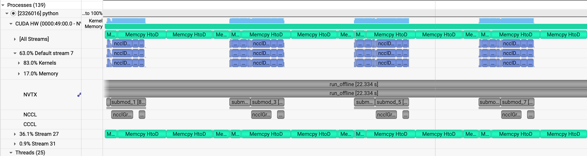
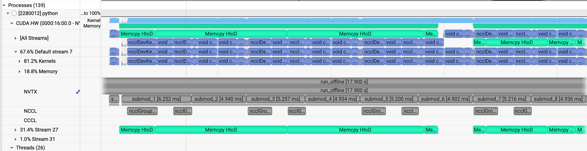
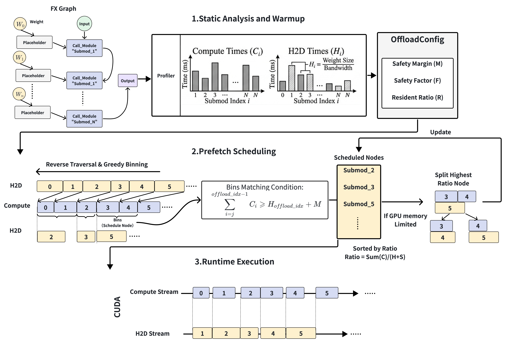

# Analysis of Automatic Offloading

> **Author:** [Taoran Wang](wangtaoran0504@outlook.com)

When training or inferencing ultra-large models, GPU memory capacity is the primary bottleneck. The standard industry solution is Offloading—moving a portion of model weights to the CPU and dynamically Prefetching them back to the GPU just before computation.

However, the emergence of high-computational-efficiency models, such as [daVinci-MagiHuman](https://github.com/GAIR-NLP/daVinci-MagiHuman) base 256p, poses a challenge to traditional offload strategies. Because these models execute operators extremely quickly, the ``Overlap Window`` left for PCIe data transfer is exceptionally short. If prefetching is not precise, the GPU frequently enters a ``starvation`` state while waiting for data, resulting in significant pipeline bubbles.

  
  

  <em>Left: Base Offload with noticeable GPU starvation (bubbles). Right: Heuristic Offload eliminating pipeline bubbles and accelerating daVinci-MagiHuman.</em>

This article dives into the core source code of MagiCompiler ([api.py](../magi_compiler/api.py), [offload_wrapper.py](../magi_compiler/offload/offload_warpper.py), and [scheduler.py](../magi_compiler/offload/scheduler.py)) to deconstruct how it achieves deep overlap between computation and transmission.

## Architectural Overview: Graph-Based Asynchronous Pipeline
MagiCompiler’s Offload mechanism is built upon the torch.fx graph mode. Its core logic involves using an independent CUDA Stream to pull weights for subsequent modules while the current submodule is still computing.

- [OffloadExecutor](../magi_compiler/offload/offload_warpper.py) / [OffloadWrapper](../magi_compiler/offload/offload_warpper.py): Responsible for operator graph parsing, memory lifecycle management, and execution flow scheduling.
- [OffloadScheduler](../magi_compiler/offload/scheduler.py): The core strategy layer that determines the residency priority of weights and the precise timing of prefetch triggers.

## Low-Level Optimization: Shared & Pinned Memory
Efficient data movement relies on low-level physical memory optimization. During the compilation phase, MagiCompiler implements two critical configurations for CPU Offload:
- Distributed Shared Memory: When [model_cpu_offload](../magi_compiler/config.py) is enabled, all weights are reused within contiguous memory blocks via [torch.from_file(shared=True)](https://docs.pytorch.org/docs/stable/generated/torch.from_file.html). This effectively reduces CPU overhead and memory fragmentation in multi-GPU environments.
- Pinned Memory: By using pin_memory_in_place, weights are forced to reside in non-pageable physical memory. This is the foundation for maximizing PCIe bandwidth utilization and achieving high-speed Host-to-Device (H2D) transfers.

## Operational Mechanism: Fine-Grained Executor Control
- Graph Analysis: _analyze_graph pre-traverses the torch.fx.GraphModule to calculate reference counts (user_counts) for each node, providing the basis for ``use-and-discard`` memory release.
- Profiling: During the initial runs, the OffloadProfiler measures the computation time and H2D bandwidth for each submodule. Once warming up concludes, _finalize_warmup() feeds this empirical data into the scheduler to generate a static optimal strategy.
- Dynamic Memory Management: Asynchronous prefetching is triggered before call_module. Immediately after execution, tensors are cleared from the environment based on reference counts, utilizing record_stream to ensure the memory is physically released only when safe.

## Scheduling Strategies: Heuristics for High-Speed Models (scheduler.py)
To handle fast-paced models like [daVinci-MagiHuman](https://github.com/GAIR-NLP/daVinci-MagiHuman), MagiCompiler offers three evolving schedulers:

**BaseScheduler**: A basic look-ahead strategy that prefetches only 1–2 modules in advance. In scenarios with long sequences or fast operators, this simple approach often fails to cover the transmission latency.

**CostEffectiveScheduler**: This strategy corrects the intuitive error of prioritizing ``long-computation operators.`` It identifies that modules with massive weight volumes but lightning-fast computation are the primary source of bubbles. Consequently, it allocates the limited GPU residency quota to these ``transfer-heavy, compute-light`` modules.

**HeuristicScheduler**：

  - JIT (Just-In-Time) Latest Loading: The most advanced solution, introducing a mechanism. It uses profiling data to reverse-calculate the exact start time for transmission, ensuring weights arrive at the GPU at the ``last possible second`` before computation. This prevents memory bloat from queued weights and compresses peak memory usage to its theoretical minimum.
  - Weight Residency Optimization: If residual GPU memory is detected (based on the gpu_resident_weight_ratio), it will designate specific weights to remain resident on the GPU, thereby alleviating pressure on the PCIe bandwidth.

## Performance: Zero-Bubble Experience on RTX 5090
In an RTX 5090 environment using a CP4 parallel strategy for a 10-second long-video generation inference test with [daVinci-MagiHuman](https://github.com/GAIR-NLP/daVinci-MagiHuman) base 256p:

By setting gpu_resident_weight_ratio to 35%, the system allocates this ``prime`` GPU memory to large-volume, fast-computation operators. The remaining 65% of weights are managed via the HeuristicScheduler for precise JIT prefetching.

The Result: The 10s video inference process achieved complete overlap between H2D communication and computation. Despite the extremely high operator throughput, the GPU remained fully utilized with zero pipeline bubbles, reaching the theoretical limits of both memory efficiency and system throughput.
